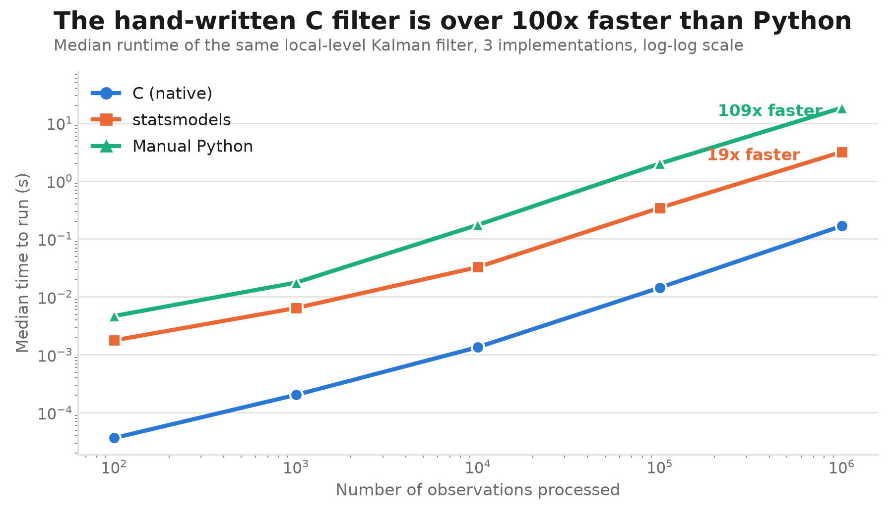

<div align="center">

# kalman-c

**Kalman filter implemented in C, exposed to Python via `ctypes`, validated against `statsmodels.tsa.UnobservedComponents`.**

</div>

- **19x faster** than statsmodels at N=10⁶ observations (24–49x at smaller N)
- Filtered states match statsmodels to **1.9e-9** on simulated data, **2.9e-11** on real UK house-price data
- Pure C, hand-rolled matrix routines — no external numerical libraries
- Portfolio / learning project, not intended for production use — see [Limitations](#limitations--future-work)

### Contents
[Benchmark](#benchmark) · [Models](#models) · [Structure](#structure) · [Build](#build) · [Usage](#usage) · [Validation](#validation) · [Limitations](#limitations--future-work)

---

## Benchmark

<div align="center">



</div>

Local level model, median wall time over 7 runs, series length up to 10^6
observations. The C filter vs. **statsmodels** — an optimized, Cython/C-backed
library and the relevant baseline — is **19x faster at N=10^6** (24–49x at
smaller N). Against a naive line-by-line Python port of the same recursion
(`python/kalman_python.py`), it is **109x faster at N=10^6** — included as
context, not the headline claim, since naive Python is not a realistic
baseline.

---

## Models

State-space form: `y_t = Z a_t + ε_t`, `a_t = T a_{t-1} + η_t`,
`ε_t ~ N(0, H)`, `η_t ~ N(0, Q)`. The C code implements the general
predict/update recursion for arbitrary `T`/`Z`; two configurations are
validated.

**Local level** — `a_t` is a scalar, `T = 1`, `Z = 1`.

$$
\begin{aligned}
\textbf{Predict:} \quad & a_{t|t-1} = a_{t-1|t-1} & & P_{t|t-1} = P_{t-1|t-1} + Q \\
\textbf{Update:} \quad & v_t = y_t - a_{t|t-1} & & F_t = P_{t|t-1} + H \\
& K_t = P_{t|t-1} / F_t & & a_{t|t} = a_{t|t-1} + K_t v_t \\
& P_{t|t} = P_{t|t-1} (1 - K_t)
\end{aligned}
$$

**Local linear trend** — state `[level, slope]`, `T = [[1,1],[0,1]]`,
`Z = [1, 0]`.

$$
\begin{aligned}
\textbf{Predict:} \quad & a_{t|t-1} = T a_{t-1|t-1} & & P_{t|t-1} = T P_{t-1|t-1} T^\top + Q \\
\textbf{Update:} \quad & v_t = y_t - Z a_{t|t-1} & & F_t = Z P_{t|t-1} Z^\top + H \\
& K_t = P_{t|t-1} Z^\top F_t^{-1} & & a_{t|t} = a_{t|t-1} + K_t v_t \\
& P_{t|t} = P_{t|t-1} - K_t Z P_{t|t-1}
\end{aligned}
$$

Each update also returns the Gaussian log-likelihood contribution
`-0.5 (log 2π + log F_t + v_t² / F_t)`, summed over the series.

---

## Structure

<details>
<summary>Show directory tree</summary>

```
src/
  kalman.c / kalman.h     predict/update/filter recursion, generic T/Z
  matrix.c / matrix.h     small dense matrix ops (mul, add, transpose)
python/
  kalman_wrapper.py       ctypes bindings to libkalman.so
  kalman_python.py        pure-Python reference implementation (benchmark baseline)
  data_utils.py           UK house price series loader
tests/
  kalman_test.c           C smoke test
  matrix_test.c           matrix op tests
  local_level_test.py     vs statsmodels, local level, simulated data
  linear_trend_test.py    vs statsmodels, local linear trend, simulated data
  hprice_test.py          vs statsmodels, local level, real UK house price series
  test_python_impl.py     Python reference vs C
benchmarks/
  benchmark.py            timing harness: C vs statsmodels vs Python
  benchmark_plots.py      generates runtime_scaling.png
  results.csv
  runtime_scaling.png
data/
  Average-prices-2026-03.csv   UK HPI, England, quarterly
Makefile
requirements.txt
```

</details>

## Build

<details>
<summary>Show build steps</summary>

```
make            # builds libkalman.so
make test_llt   # builds the C smoke test binary
```

`libkalman.so` is a shared library (`gcc -shared`, `-fPIC`) loaded directly
by `python/kalman_wrapper.py` via `ctypes.CDLL`.

```
python -m venv venv && source venv/bin/activate
pip install -r requirements.txt
```

</details>

## Usage

<details>
<summary>Show usage example</summary>

```python
from python.kalman_wrapper import run_kalman_filter

# local level: y_t = a_t + e_t,  a_t = a_{t-1} + h_t
a_out, loglik, state = run_kalman_filter(
    y=[1.0, 2.0, 1.5, 3.0, 2.5],
    a0=[0.0], P0=[1.0],
    H=1.0, Q=[0.1],
    Z=[1.0], Tmat=[1.0],
    n=1,
)
# a_out: (n_obs, n) filtered state means
# loglik: summed Gaussian log-likelihood
```

For local linear trend, pass `n=2`, `Z=[1.0, 0.0]`,
`Tmat=[1.0, 1.0, 0.0, 1.0]`, and 2x2-flattened `P0`/`Q`.

</details>

---

## Validation

`tests/local_level_test.py`, `tests/linear_trend_test.py`, and
`tests/hprice_test.py` each run the C filter and
`statsmodels.tsa.UnobservedComponents` on the same data with the same
initial state, and compare filtered states and log-likelihood:

| Test | Data | Max abs state diff | Loglik diff |
|---|---|---|---|
| Local level | simulated, T=1000 | 1.7e-9 | 1.2e-8 |
| Local linear trend | simulated, T=1000 | 1.9e-9 | 1.4e-8 |
| Local level | UK house prices (England, quarterly, 1975–), T=205 | 2.9e-11 | 6.8e-13 |

## Limitations / future work

- No fixed-interval smoother (forward filter only).
- No EM or MLE-based parameter estimation — `H`/`Q` are passed in, not fit.
- `T`, `Z`, `H`, `Q` are fixed per call; no time-varying system matrices.
- No SIMD or cache-blocking in the matrix routines.
- Bound via `ctypes`; no CPython C-API extension module.